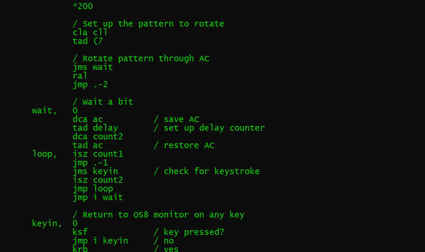
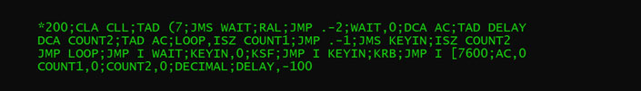

P8PP -- PAL8 preprocessor for PDP8 OS8
==========

This utility will take PAL8 source for PDP8 OS8 and prepare it for use on a PDP8.  It will:

* convert the source to upper case,
* remove comments,
* concatenate lines,
* and remove extraneous whitespace.

This is a preprocessor that merely massages the source; it is not a compiler.  The resulting source
is optimized for source file size and for pasting into SIMH.  It's not well-suited for generating listing
files once it's on the PDP8, though.

I've included two demo programs; the .pal files are the original source and the .pa files are
the corresponding programs after preprocessing:

* hello.pal, hello.pa -- A "HELLO WORLD!" program
* cylon.pal, cylon.pa -- Rotates some bits through the AC

Example usage: `p8pp < cylon.pal > cylon.pa

